# Git SSH Key Pair Setup

## Generate SSH Key in Windows (Using Git Bash)

Open **Git Bash** terminal and run the below command:

```bash
ssh-keygen -t rsa -C "pasumarthisrinu123@gmail.com"
```
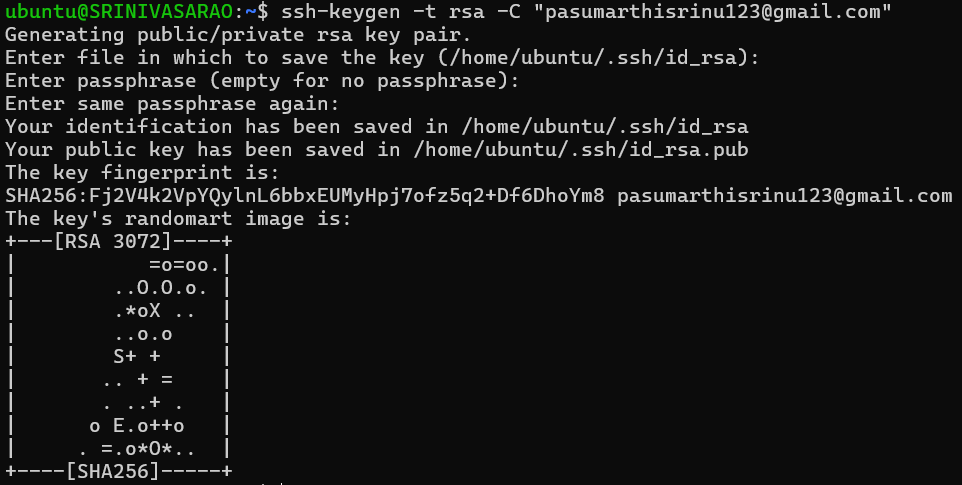

## Verify the SSH key-pair
Run the below command:
```bash
ls -lrth ~/.ssh/
```
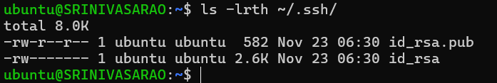

## SSH RSA private key matches a public key
Run the below command:
```bash
ssh-keygen -l -f ~/.ssh/id_rsa
```
Run the below command:
```bash
ssh-keygen -l -f ~/.ssh/id_rsa.pub
```

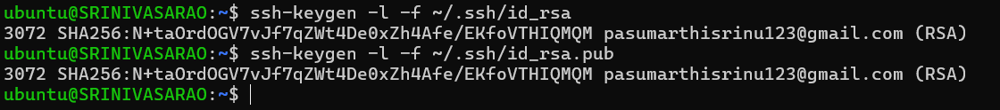

## SSH RSA Public key copy
Run the below command:
```bash
cat ~/.ssh/id_rsa.pub
```
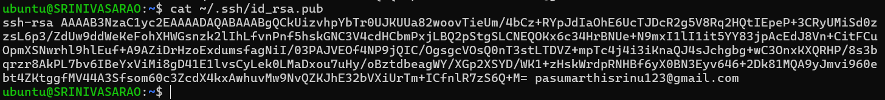

## Configure SSH public key on GITHUB Website: https://github.com/

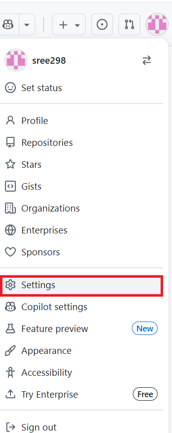

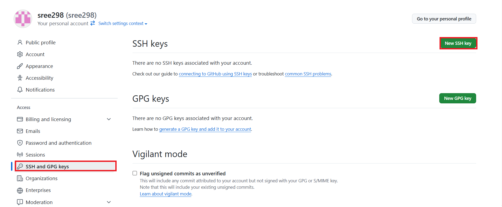

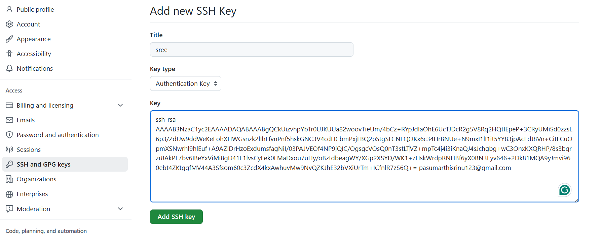

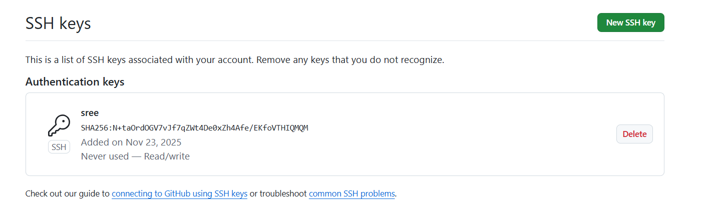


## Verify the GITHUB connectivity
Run the below command:
```bash
ssh -T git@github.com
```
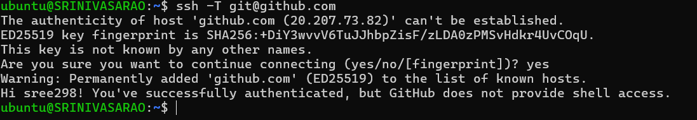

## Create New Repo on Github
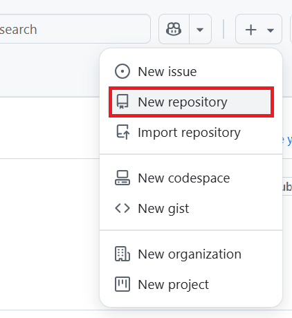
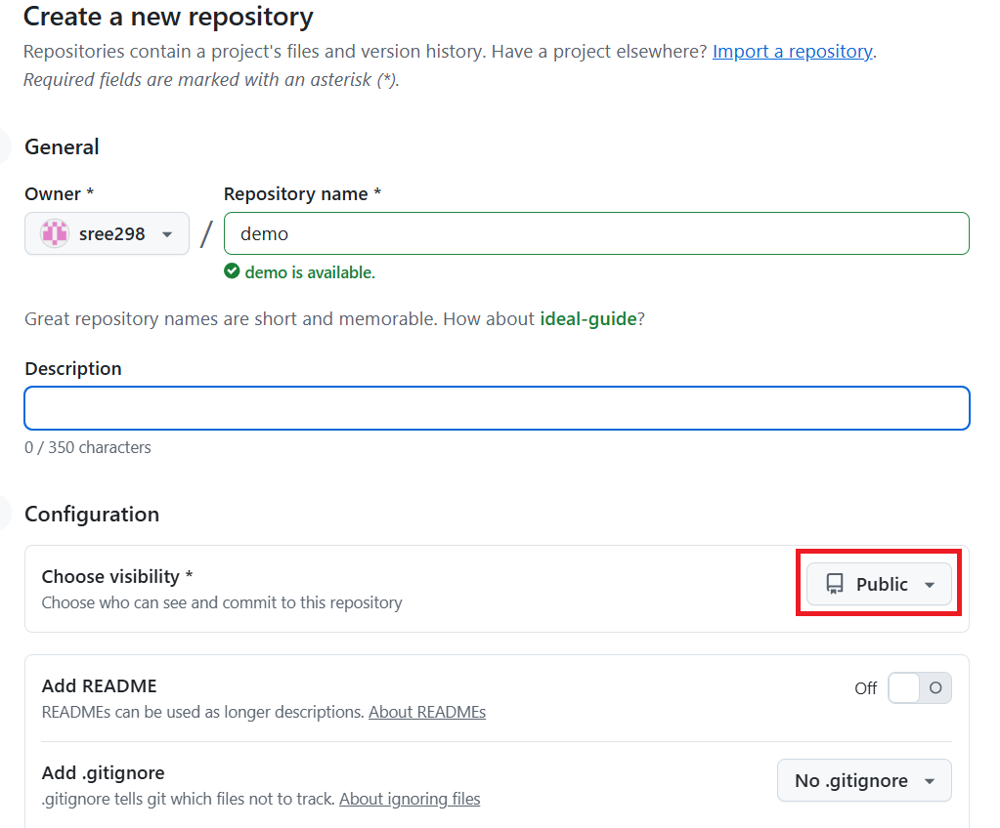


