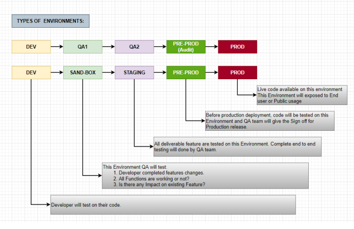

#### setup the name and email that will be attached your commit and tags
```bash
git config --global user.name "sree"
git config --global user.email "sree@gmail.com"
git config --global --list
```
#### Set up local repo
#### Option-1
#### Create a new directory
```bash
$ mkdir git-demo
```
#### Navigate to git-demo directory
```bash
$ cd git-demo
```
#### Create the new local-repo
```bash
$ git init
```
---------------------
#### Option-2
#### Clone the repo from GITHUB
```bash
$ git clone -b <branch-name> <github-url>
```
#### HTTPS URL
```bash
$ git clone -b main https://github.com/sree298/git-demo.git
```
#### SSH URL
```bash
$ git clone -b main git@github.com:sree298/git-demo.git
```
### GIT Work flow for New Repo (init)
#### Create a new directory
```bash
$ mkdir git-demo
```
#### Navigate to git-demo directory
```bash
$ cd git-demo
```
### Set user-name and email-id (One time configuration only)

```bash
$ git config --global user.name "sree"
$ git config --global user.email "sree@gmail.com"
```
#### Create the new local-repo
```bash
$ git init
```
#### Check the status of changes
```bash
$ git status
```
#### Check the last 5 commits
```bash
$ git log -n 5
```
#### add the new file
```bash
$ vi ram.txt
M1
```
#### add/move the file to staging area
```bash
$ git add ram.txt
```
#### Commit the chnages
```bash
$ git commit -m "M1"
```
#### Check the last 5 commits
```bash
$ git log -n 5
```
#### add remote GITHUB repo
#### SSH URL
```bash
$ git remote add origin git@github.com:sree298/git-demo.git
```
#### HTTPS URL
```bash
$ git remote add origin https://github.com/sree298/git-demo.git
```
#### Verify the git remote details
```bash
git remote -v
```
#### push the code to remote repo (Github)
```bash
git push origin main
```
### GIT Work flow for Existing Repo
#### Clone the github repo
```bash
git clone -b <branch-name> <github-url>
```
#### HTTPS URL
```bash
$ git clone -b main https://github.com/sree298/git-demo.git
```
#### SSH URL
```bash
$ git clone -b main git@github.com:sree298/git-demo.git
```
#### Navigate to git-demo directory
```bash
$ cd git-demo
```
#### set user-name and email-id (One time configuration only)
```bash
$ git config --global user.name "shiva"
$ git config --global user.email "shiva@gmail.com"
$ git config --global --list
```
#### Check the last 5 commits
```bash
$ git log -n 5
```
#### add the new file
```bash
$ vi ram.txt
M2
```
#### add/move the file to staging area
```bash
$ git add ram.txt
```
#### Commit the chnages
```bash
$ git commit -m "M2"
```
#### Check the last 5 commits
```bash
$ git log -n 5
```
#### Check the last commits in graph
```bash
$ git log --all --decorate --oneline --graph
```
#### Check the last commits in one-line
```bash
$ git log --all --pretty=oneline
```
#### Verify the git remote details
```bash
git remote -v
```
#### push the code to remote repo (Github)
```bash
git push origin main
```
### Types of Environments



